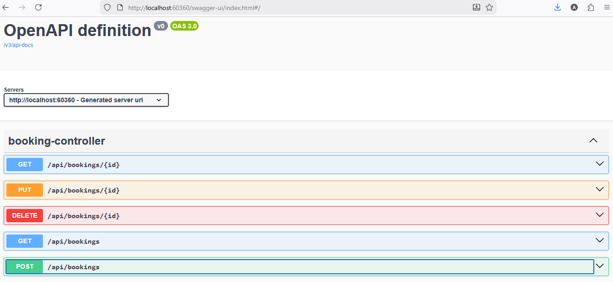
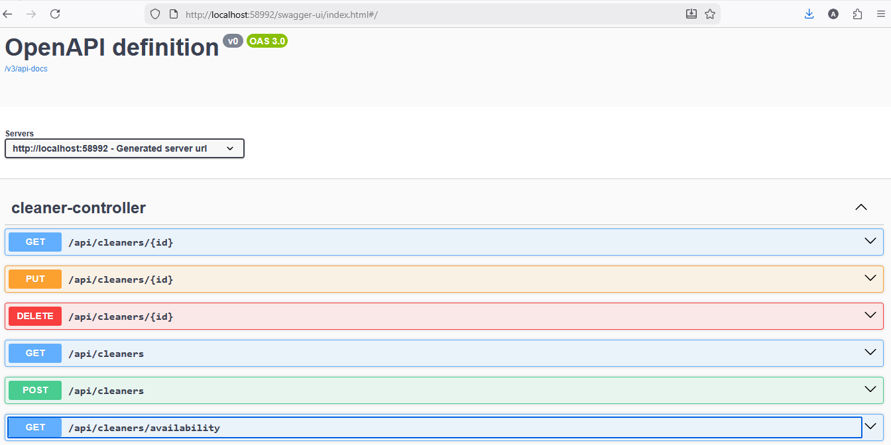
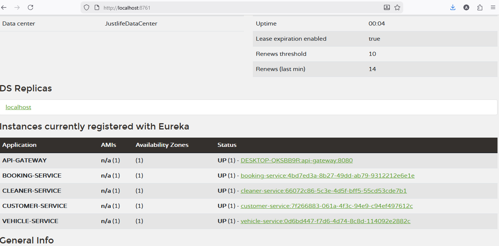
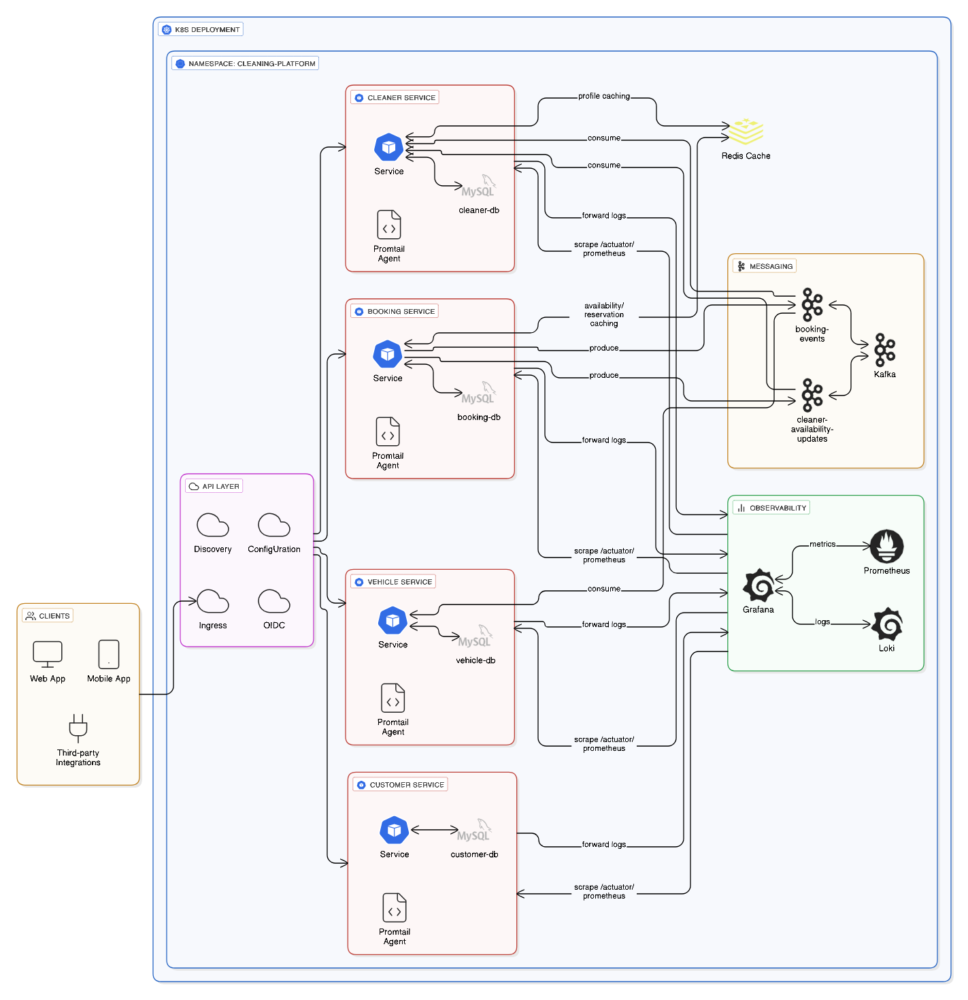

# JustLife Cleaning Platform – Case Study Assignment

## Overview

This document provides a complete description of the microservices architecture built using Spring Boot, Spring Cloud, Eureka, Config Server, Cloud Gateway, and MySQL databases.

### Microservices Included
- **config-server**
- **discovery-server**
- **api-gateway**
- **customer-service**
- **vehicle-service**
- **cleaner-service**
- **booking-service**

Each service supports REST APIs and service discovery via Eureka.

---


## Micro-Services

### Customer Service
- `POST /api/customers`
- `GET /api/customers/{id}`
- `GET /api/customers?page=0&size=10`
- `PUT /api/customers/{id}`
- `DELETE /api/customers/{id}`

### Vehicle Service
- `POST /api/vehicles`
- `GET /api/vehicles/{id}`
- `GET /api/vehicles?page=0&size=10`
- `PUT /api/vehicles/{id}`
- `DELETE /api/vehicles/{id}`

### Cleaner Service
- `POST /api/cleaners`
- `GET /api/cleaners/{id}`
- `GET /api/cleaners?page=0&size=10`
- `PUT /api/cleaners/{id}`
- `DELETE /api/cleaners/{id}`
- `GET /api/cleaners/availability`

### Booking Service
- `POST /api/bookings`
- `GET /api/bookings/{id}`
- `GET /api/bookings?page=0&size=10`
- `PUT /api/bookings/{id}`
- `DELETE /api/bookings/{id}`

---

## Database Setup

Run:
```
mysql -u root -p < db-schema-and-data.sql
```

Creates databases:
- `customer_service_db`
- `vehicle_service_db`
- `cleaner_service_db`
- `booking_service_db`
- `auth_service_db`

---

## Running the Services

Start in order:
1. discovery-server  
2. config-server  
4. customer-service  
5. vehicle-service  
6. cleaner-service  
7. booking-service  
8. api-gateway  

---

## Build All Services

```
mvn clean install -DskipTests
```
---
## Swagger UI 
Swagger UI looks like below
#### Bookings

#### Cleaners


---
## Postman Collection

Import the below postman collection and set the Environment variable booking-platform and call the APIs.
```
docs/justlife-booking-platform.postman_collection.json
booking-platform = http://localhost:8080
```

---
## Discovery Service

##### Registered Services



---
## Actuator & Prometheus Monitoring

All microservices include:
- Spring Boot Actuator
- Micrometer
- Prometheus metrics exporter

### Enable Dependencies (pom.xml)

```xml
<dependency>
    <groupId>org.springframework.boot</groupId>
    <artifactId>spring-boot-starter-actuator</artifactId>
</dependency>
<dependency>
    <groupId>io.micrometer</groupId>
    <artifactId>micrometer-registry-prometheus</artifactId>
</dependency>
```

### application.yml Configuration

```yaml
management:
  endpoints:
    web:
      exposure:
        include: health, prometheus, info, metrics
  endpoint:
    health:
      show-details: always
  metrics:
    tags:
      application: ${spring.application.name}
```

### Actuator Endpoints

| Endpoint | Description |
|---------|-------------|
| /actuator/health | Overall health |
| /actuator/health/liveness | Liveness |
| /actuator/health/readiness | Readiness |
| /actuator/info | App info |
| /actuator/metrics | Metrics index |
| /actuator/prometheus | Prometheus-exported metrics |

---

### Popular Metrics

| Metric | Description |
|--------|-------------|
| jvm_memory_used_bytes | JVM memory usage |
| process_cpu_usage | CPU usage |
| http_server_requests_seconds_count | HTTP request count |
| http_server_requests_seconds_sum | Request duration |
| tomcat_sessions_active_current | Active sessions |

---

## Notes
- Pagination supported via Spring Data JPA
- All services are Eureka clients
- API Gateway handles routing

## Future Recommendations

### Suggested Architecture


1. Implementation of Cache using Redis and Spring Cache  
2. OAuth 2.x and OIDC(Custom/Existing) like KeyCloak
3. Use Spring Cloud Stack for Development and K8s for Production environment.
4. Using of Service Mesh like ISTIO.
5. Add invoice,payment and notification services.  

### OLAP and Data pipeline

1. Create OLAP Star-schema of OLTP for analytics.
2. For Data pipeline Use Apache Airflow and create a DAG to populate the OLAP database for Analytics dashboards.
3. For real time OLAP we must use Debezium (database CDC) with Kafka to populate realtime OLAP.